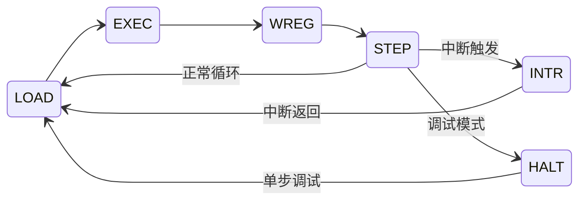

# MERC32

[](https://opensource.org/licenses/MIT)
[](https://en.wikipedia.org/wiki/Verilog)

一个轻量级32位RISC CPU核心，采用Verilog HDL实现，面向嵌入式系统和SoC应用。

<p align="center">
  
  
  
  
</p>

---

## ✨ 特性

- 🚀 **单周期执行** - 大多数指令在一个指令周期完成
- 📦 **资源占用少** - 适合FPGA实现，逻辑资源消耗低
- 🔌 **支持多接口** - 支持 AMBA 标准总线接口，便于集成到ARM/SoC系统
- 📝 **灵活指令集** - 4位操作类型 × 4位功能码 = 最多256条指令
- 🔄 **中断控制器** - 支持软件配置中断使能，中断触发方式，中断向量
- 🔢 **有符号数支持** - 原生支持有符号数运算和比较
- 🎨 **VSCode 扩展** - 集成汇编器、编译器、语法高亮、代码片段

---

## 🚀 快速开始

### 文件结构

```
MERC32/
├── docs/                         # 文档
├── example/                      # 示例程序
├── merc32-vsce/                  # VSCode 汇编器扩展
├── rtl/                          # RTL源代码
├── LICENSE                       # MIT许可证
└── README.md                     # 项目介绍
```

### 端口说明

| 信号 | 方向 | 位宽 | 描述 |
|------|------|------|------|
| `clk` | Input | 1 | 系统时钟 |
| `rst_n` | Input | 1 | 低电平有效复位 |
| `interrupt` | Input | 1 | 中断请求信号 |
| `tck` | Input | 1 | JTAG 调试接口 |
| `tms` | Input | 1 | JTAG 调试接口 |
| `tdi` | Input | 1 | JTAG 调试接口 |
| `tdo` | Output | 1 | JTAG 调试接口 |

### 顶层参数

| 参数 | 默认值 | 说明 |
|------|--------|------|
| `ILB_ADDR_WIDTH` | `16` | 指令本地总线字地址宽度 |
| `DLB_ADDR_WIDTH` | `16` | 数据本地总线字地址宽度 |
| `JTAG_IDCODE_VALUE` | `32'h4d32_0001` | JTAG IDCODE |
| `DEBUG_EN` | `1` | 设为 `1` 启用 JTAG 调试；设为 `0` 时综合裁剪调试模块，并将 `tdo` 固定为 `0` |

### 固定软件地址映射

| 区域 | 字节地址范围 |
|------|--------------|
| ILB | `0x00000000` - `0x07FFFFFF` |
| DLB | `0x08000000` - `0x0FFFFFFF` |
| PLB | `0x10000000` - `0xFFFFFFFF` |

**标准总线接口**

本地数据空间总线和指令空间总线，用于连接 spram.v 或者 fpga 的 ram IP 核：

| 信号 | 方向 | 描述 |
|------|------|------|
| `dlb_*` | Master | 数据空间总线 |
| `ilb_*` | Master | 指令空间总线 |

还有一个外设总线，通过宏选择总线接口（优先级从高到低）：

| 宏定义 | 总线类型 | 说明 |
|--------|---------|------|
| `IF_AXI_LITE` | AXI4-Lite | AMBA标准总线，ARM/SoC常用 |
| `IF_APB` | APB | AMBA外设总线 |
| `IF_WBC` | Wishbone | 开源总线标准 |
| `IF_AVALON` | Avalon-MM | Intel FPGA总线接口 |
| `IF_DRP` | DRP | Xilinx动态重配置端口 |
| 默认 | Local Bus | 本地总线直连 |

---

## 🛠️ VSCode 工具链扩展

项目提供 `merc32-vsce` VSCode 扩展，集成了 MERC32 汇编器与 Tiny C 编译器，并通过活动栏侧边栏组织构建命令与产物。打开 `.asm` / `.c` 文件时，扩展会提供语法高亮、代码片段以及右上角的一键编译按钮，支持正常、打印、调试三种编译模式，并可将结果输出为 Verilog、COE、MIF、Intel HEX、Binary 或 `$readmemh` 内存文件。

详细安装、使用方法与配置项见 [merc32-vsce/README.md](merc32-vsce/README.md)。

---

## 🏗️ 架构

### 微架构

项目采用状态机架构，程序运行稳定，吞吐量低



### 寄存器文件

- 软件可见 16 个 32 位寄存器，其中 `r0` 固定为 `0`
- `r1-r3` 和 `r15` 为专用寄存器，`r4-r14` 为通用寄存器组
- 复位后寄存器初始化为 `0`；通用寄存器组在 CPU 的初始化状态中逐项清零

### 寄存器使用约定

| 寄存器 | 用途 | 说明 |
|--------|------|------|
| `r0` | 零寄存器 | 固定为0，**不可写入** |
| `r1` | 中断控制寄存器 | r1[0]=中断使能，r1[2:1]=中断触发类型 |
| `r2` | 中断跳转寄存器 | 中断跳转地址 |
| `r3` | 中断返回寄存器 | 中断返回地址 |
| `r4-r14` | 通用寄存器 | 可自由使用 |
| `r15` | PC寄存器 | 软件可读写，空闲时自动刷新为当前指令地址 |

### JTAG 单寄存器访问

JTAG 指令宽度为 5 位，寄存器访问指令 `IR_DBG_REGS` 的编码为
`5'b10011`。该指令使用一个 37 位数据寄存器，每次只读取一个 CPU
寄存器：

| 位段 | 含义 |
|------|------|
| `[0]` | 请求位；在 `Update-DR` 写入 `1` 发起一次读取，捕获响应时恒为 `0` |
| `[4:1]` | 寄存器编号 `0-15`；响应中返回实际读取的编号 |
| `[36:5]` | 32 位寄存器数据；发起请求时忽略 |

CPU 只有在调试暂停状态下才接受寄存器读取请求。发起请求后，可读取
`IR_DBG_STATUS`：bit 5 为寄存器事务忙标志，bit 6 为响应有效标志。
等待 bit 5 清零并确认 bit 6 为 `1` 后，再捕获 `IR_DBG_REGS` 取得编号和
数据。事务忙时提交的新请求不会启动另一笔访问。

---

## 📄 许可证

本项目采用 [MIT License](LICENSE) 许可证。

---

## 👤 作者

- **Mercer**
- WeChat: zxw895674551
- Email: alexmercer@outlook.com

---

## 📚 相关文档

- [指令集参考](ISA.md) - 完整的指令集说明
- [VSCode 汇编器扩展](assembler/README.md) - 扩展安装、使用和市场页说明

---

<p align="center">
  Made with ❤️ for FPGA enthusiasts
</p>
