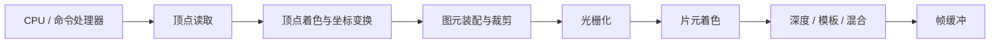
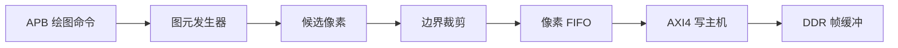
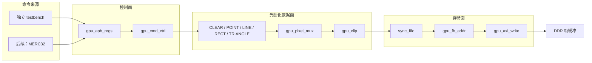
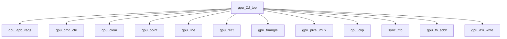
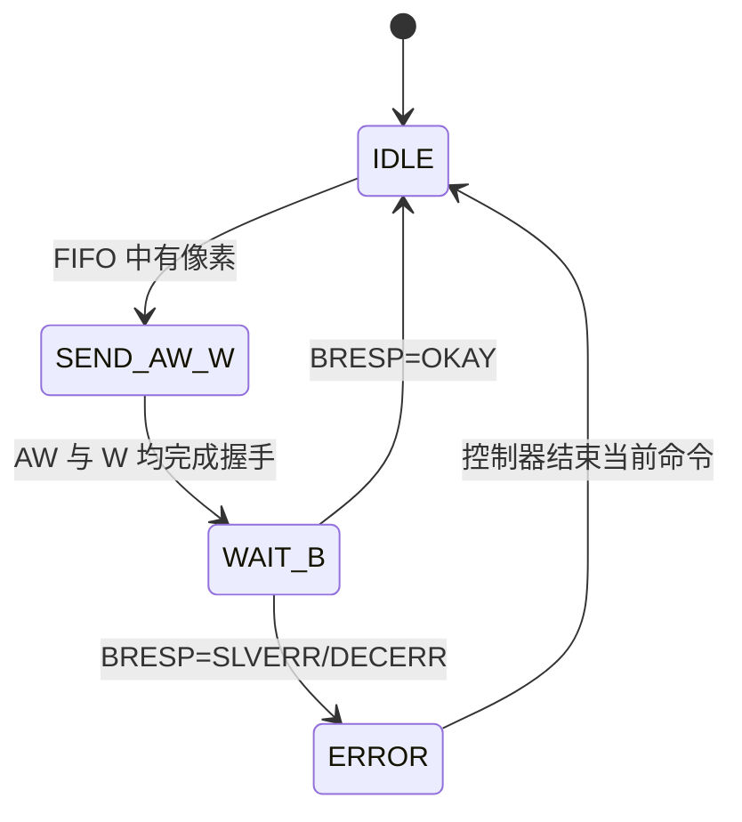
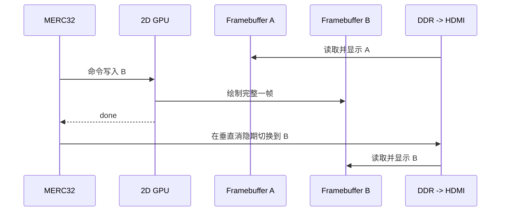

# Verilog 简易 2D GPU：基础理论、最小架构与开发路线

本文面向已有基础 Verilog/FPGA 经验、希望通过实际 RTL 理解 GPU 的学习者。目标不是直接复制现代桌面 GPU，而是从一个可验证的固定功能 2D 光栅器开始，建立对命令提交、图元遍历、像素生成、帧缓冲和 DDR 写入的完整认识。

本文档同时给出理论知识、最小实现规格、模块边界、验证方法和后续演进路线。第一版先在仿真中独立运行，再作为内存映射协处理器接入现有 MERC32；GPU 通过 AXI4 Memory-Mapped 主接口写 DDR。DDR 读取和 HDMI 输出已有实现，不属于本设计范围。

## 1. 项目目标与边界

### 1.1 学习目标

完成本项目后，应能够解释并实现以下内容：

1. GPU 为什么适合并行处理像素，以及固定功能 GPU 与可编程 GPU 的区别。
2. 绘图命令如何变成点、线、矩形和三角形覆盖的像素。
3. 光栅器如何在下游阻塞时保持状态，保证不重写、不丢写。
4. 像素坐标如何转换为 DDR 帧缓冲地址。
5. AXI4 的 AW、W、B 三个写通道如何独立握手。
6. CPU 如何通过寄存器提交命令并查询完成或错误状态。
7. 如何用软件参考模型、模块 testbench 和 AXI 内存模型验证图形结果。

### 1.2 最小版本包含的功能

- Verilog-2005 RTL，所有源文件使用 `.v`。
- APB 控制从接口，由 testbench 或 MERC32 提交命令。
- AXI4 Memory-Mapped 写主接口，将 RGB565 像素写入 DDR。
- 可配置帧缓冲基地址、宽度、高度和每行字节数。
- `CLEAR`、`POINT`、`LINE`、`RECT`、`TRIANGLE` 五种串行命令。
- 16 位有符号屏幕坐标，左上角为原点。
- 公共边界裁剪、状态寄存器和最小错误报告。
- 像素 FIFO，用于吸收 AXI 背压。
- 每个模块独立 testbench，以及顶层集成 testbench。

### 1.3 第一版明确不包含的功能

- DDR 读取、VGA/HDMI 时序和显示控制器。
- 顶点变换、齐次裁剪、透视投影和浮点运算。
- 深度缓冲、纹理、颜色插值、Alpha 混合和抗锯齿。
- 命令 FIFO、DDR 命令缓冲区和 DMA 取命令。
- AXI 突发合并、多个 outstanding 事务和吞吐率目标。
- 着色器 ISA、SIMD/SIMT 执行核心和线程调度。

### 1.4 最小版本完成标准

最小版本只有在以下条件全部满足后才算完成：

- 五类命令均可通过 APB 正确提交并串行执行。
- 写入 AXI 内存模型的帧缓冲与软件参考模型逐像素一致。
- 随机 AW/W 背压下不丢像素、不重复像素，数据保持规则正确。
- 有像素的命令只在最后一个像素收到成功写响应后置 `done`；合法空操作在图元结束且 FIFO/AXI 均空闲后置 `done`。
- 非法配置、忙时再次启动和 AXI 写响应错误均可观察。
- 各模块 testbench 和顶层 testbench 均通过。

## 2. GPU 架构的基本理论

### 2.1 CPU 与 GPU 的设计取向

CPU 和 GPU 都执行计算，但优化目标不同。

| 对比项 | CPU | GPU |
|---|---|---|
| 主要目标 | 单线程延迟、复杂控制 | 大量相似数据的总吞吐量 |
| 执行单元 | 数量较少、单核功能强 | 数量较多、单元相对简单 |
| 控制流 | 擅长分支、异常和不规则任务 | 擅长规则、重复的数据并行任务 |
| 存储系统 | 大缓存降低访问延迟 | 高带宽和大量并发隐藏延迟 |
| 典型任务 | 操作系统、控制逻辑、串行算法 | 图形、矩阵、图像、机器学习 |

现代 GPU 常用大量线程隐藏存储延迟，但这不是学习 GPU 的唯一起点。固定功能光栅器已经包含 GPU 最重要的几个思想：规则数据流、流水化、统一握手、像素级并行潜力和高带宽帧缓冲访问。

### 2.2 经典图形流水线

典型 3D 图形流水线如下：



本项目直接接收屏幕坐标，因此从“光栅化”附近开始：



被跳过的顶点、纹理、深度和可编程着色阶段可以在掌握最小光栅器后逐步加入。

### 2.3 顶点、图元、片元和像素

- **顶点（vertex）**：描述位置以及可选颜色、纹理坐标等属性。
- **图元（primitive）**：由顶点组成的点、线或三角形。
- **光栅化（rasterization）**：判断图元覆盖哪些像素采样点。
- **片元（fragment）**：光栅化产生的候选像素及其属性；它可能在深度或裁剪测试中被丢弃。
- **像素（pixel）**：最终写入帧缓冲的颜色单元。

第一版没有深度、混合和纹理，因此候选片元通过边界裁剪后即可视为待写像素。

### 2.4 GPU 中的三类并行性

1. **图元并行**：多个三角形同时处理。
2. **像素并行**：同一图元的多个像素同时处理。
3. **流水并行**：命令解析、光栅化和存储写入同时处理不同数据。

最小版本故意一次只执行一条命令、一次生成一个候选像素。这样可以先验证语义。模块间的 `valid/ready` 接口保留了后续流水化和复制执行单元的空间。

### 2.5 固定功能与可编程架构

固定功能模块只完成指定算法，例如 Bresenham 画线或边函数三角形填充。优点是面积小、吞吐可预测、易于验证；缺点是功能变化需要修改 RTL。

可编程 GPU 使用向量 ALU、寄存器文件、指令译码和线程调度器执行着色器程序。它更灵活，但会引入 ISA、编译器、分支发散、访存合并和线程状态等大量新问题。学习路线应先固定功能，再考虑可编程核心。

## 3. 选定的最小架构

### 3.1 总体结构



### 3.2 为什么先用寄存器命令引擎

第一版由软件写入命令参数寄存器，再写 `START`。GPU 锁存参数、置 `busy`、执行命令，最后置 `done` 或 `error`。

这种方式吞吐率低，但具有三个学习优势：

1. 命令边界清晰，波形中容易观察一次操作的全过程。
2. 不需要同时调试命令 DMA、AXI 读通道和命令缓存。
3. 内部命令结构以后可以直接作为 FIFO 或 DDR 命令包的基础。

建议的演进顺序是：寄存器命令 → 硬件命令 FIFO → DDR 命令缓冲区。

### 3.3 控制与数据解耦

控制器只决定当前执行哪个图元模块，不直接计算像素。每个图元模块输出统一像素流：

| 信号 | 方向 | 含义 |
|---|---|---|
| `pix_valid` | 图元模块输出 | 当前 `pix_x/pix_y/pix_color` 有效 |
| `pix_ready` | 下游输出 | 下游能够接受当前像素 |
| `pix_x` | 图元模块输出 | 16 位有符号 x 坐标 |
| `pix_y` | 图元模块输出 | 16 位有符号 y 坐标 |
| `pix_color` | 图元模块输出 | RGB565 颜色 |
| `prim_done` | 图元模块输出 | 图元最后一个采样点已完成处理 |

当 `pix_valid=1` 且 `pix_ready=0` 时，坐标、颜色和图元内部状态必须保持不变。只有 `pix_valid && pix_ready` 时才能前进到下一个候选像素。

`prim_done` 只表示图元模块已经检查完最后一个采样点，不等于整条命令已经写入 DDR。`gpu_cmd_ctrl` 还必须等待像素 FIFO 为空、AXI 写主机空闲且没有错误响应，才能设置命令级 `done`。合法空操作没有 AXI 响应可等待，在上述流水为空条件满足后直接完成。

## 4. 数据表示与帧缓冲

### 4.1 坐标系统

- x、y 均为 16 位有符号整数。
- 原点位于左上角，x 向右增加，y 向下增加。
- 有效帧缓冲范围为 `0 <= x < fb_width`、`0 <= y < fb_height`。
- 第一版要求 `1 <= fb_width <= 32768` 且 `1 <= fb_height <= 32768`，使最大有效坐标不超过 32767。
- 有符号坐标允许图元部分位于屏幕外；公共裁剪门丢弃越界像素。

图元内部进行加法、减法和包围盒计算时应扩展位宽，不能让 16 位坐标静默溢出。

### 4.2 RGB565

每个像素占 16 位：

```text
15          11 10           5 4            0
+--------------+--------------+--------------+
|    Red[4:0]  |  Green[5:0]  |   Blue[4:0]  |
+--------------+--------------+--------------+
```

在小端帧缓冲中，低地址保存 RGB565 的低 8 位，高地址保存高 8 位。第一版所有图元使用单一平面颜色，不做顶点颜色插值。

### 4.3 行步长与地址

帧缓冲不应假设每行紧密排列，因此使用字节步长：

```text
pixel_addr = fb_base + y * fb_stride_bytes + x * 2
```

必须满足：

- `fb_base` 至少 2 字节对齐。
- `fb_width > 0`，`fb_height > 0`。
- `fb_stride_bytes >= fb_width * 2`。
- 最后一行最后一个像素地址不超出 32 位地址空间。

最小版本固定 `AXI_ADDR_WIDTH=32`，与单个 32 位 `FB_BASE` 寄存器保持一致；AXI 数据宽度仍然参数化。若目标 SoC 使用超过 32 位的 DDR 地址，应先增加 `FB_BASE_HI` 寄存器，再扩大地址计算链路，而不是截断高位。

### 4.4 带宽直觉

完整覆盖一帧所需写入数据量为：

```text
bytes_per_frame = width * height * bytes_per_pixel
write_bandwidth = bytes_per_frame * frames_per_second
```

例如 640×480、RGB565、每秒清屏 60 次，仅 GPU 写入就约为：

```text
640 * 480 * 2 * 60 = 36,864,000 bytes/s
```

这还没有计算显示读取、深度、纹理和重复覆盖。GPU 架构最终会受存储带宽约束，因此后续需要突发写、缓存或瓦片化；但这些不属于正确性优先的第一版。

## 5. 五类绘图命令与算法

### 5.1 命令语义总表

| 命令 | 参数 | 输出语义 |
|---|---|---|
| `CLEAR` | 颜色 | 填充整个有效帧缓冲 |
| `POINT` | `(x0,y0)`、颜色 | 生成一个候选像素 |
| `LINE` | `(x0,y0)`、`(x1,y1)`、颜色 | 使用全八象限 Bresenham，包含两个端点 |
| `RECT` | `(x,y)`、`width`、`height`、颜色 | 填充半开区间 `[x,x+width) × [y,y+height)` |
| `TRIANGLE` | 三个顶点、颜色 | 使用边函数和 top-left 规则填充实心三角形 |

`POINT` 完全越界、矩形或三角形裁剪后为空，以及退化三角形都属于合法空操作；它们不产生 AXI 写，但正常完成。

### 5.2 清屏

清屏使用 x/y 双计数器：

1. 从 `(0,0)` 开始。
2. 当前像素完成握手后 x 加 1。
3. 到达行尾后 x 归零、y 加 1。
4. 最后一个像素被 AXI 写入并收到成功 BRESP 后，命令才完成。

清屏也可以看作一个覆盖全帧缓冲的特殊矩形。第一版可保留独立 `gpu_clear` 以便学习和测试，后续可复用扫描逻辑减少面积。

### 5.3 点

`POINT` 只产生一个候选像素。若坐标越界，公共裁剪门立即消费并丢弃该候选；若坐标有效，则等待下游接受。这个模块虽然简单，却适合最先验证统一像素握手、地址计算和 WSTRB。

### 5.4 直线：整数 Bresenham

推荐采用可处理全部八个象限的整数形式：

```text
dx = abs(x1 - x0)
sx = x0 < x1 ? 1 : -1
dy = -abs(y1 - y0)
sy = y0 < y1 ? 1 : -1
err = dx + dy

loop:
    emit(x0, y0)
    if x0 == x1 and y0 == y1: done
    e2 = 2 * err
    if e2 >= dy: err += dy; x0 += sx
    if e2 <= dx: err += dx; y0 += sy
```

实际 RTL 每次只能在当前候选像素被接受或裁剪后更新 `x0/y0/err`。测试必须覆盖水平、垂直、45 度、陡斜率、缓斜率、正反方向和单点直线。

第一版不做线段预裁剪。公共裁剪保证不会写出帧缓冲，但完全位于远处的线仍可能遍历许多无效点。后续可加入 Cohen-Sutherland 或 Liang-Barsky 裁剪。

### 5.5 实心矩形

矩形使用左上角加宽高定义，采用半开区间，可以避免相邻矩形边界的 off-by-one 问题。

开始扫描前计算：

```text
x_begin = max(x, 0)
y_begin = max(y, 0)
x_end   = min(x + width,  fb_width)
y_end   = min(y + height, fb_height)
```

若 `x_begin >= x_end` 或 `y_begin >= y_end`，命令作为合法空操作完成。`width=0` 或 `height=0` 被视为参数错误，用于尽早暴露软件问题。

### 5.6 实心三角形：边函数

对有向边 `a -> b` 和采样点 `p`，边函数可定义为：

```text
E_ab(p) = (b_x - a_x) * (p_y - a_y)
        - (b_y - a_y) * (p_x - a_x)
```

三个边函数的符号可判断采样点是否在三角形内部。实现步骤如下：

1. 计算三角形有符号面积并统一顶点绕序。
2. 面积为零时作为合法空操作完成。
3. 计算三角形包围盒，并裁剪到帧缓冲范围。
4. 在每个像素中心 `(x+0.5,y+0.5)` 采样。
5. 三条边均满足内部条件和 top-left 规则时输出像素。
6. 在包围盒中逐行移动，并增量更新边函数。

为避免浮点数，可将所有顶点坐标乘 2，并用 `(2x+1,2y+1)` 表示像素中心。边函数横向移动一像素时只需加固定增量，纵向换行时也只需加固定增量。

top-left 规则必须集中实现为一个清楚的边界谓词，并通过两个共享边的三角形验证没有裂缝或重复覆盖。不要在多个状态分支中复制略有差异的边界判断。

16 位坐标在求差、乘 2、做乘法和相减后需要更宽的有符号累加器。建议第一版使用至少 40 位边函数寄存器，并用极值坐标测试验证无溢出。

### 5.7 公共裁剪门的握手

公共裁剪门应满足：

- 输入像素越界时，不依赖下游状态，立即拉高输入 `ready` 并丢弃像素。
- 输入像素有效时，输入 `ready` 等于下游 `ready`，数据原样传递。
- 所有地址计算只接收已经通过裁剪的非负坐标。

这样可以避免有符号负坐标被转换成很大的无符号 DDR 地址。

## 6. RTL 模块划分

### 6.1 模块职责

| 模块 | 类别 | 单一职责 |
|---|---|---|
| `gpu_2d_top.v` | 顶层 | 仅声明信号、实例化模块并连接接口 |
| `gpu_apb_regs.v` | 通信接口 | APB 寄存器读写、START 脉冲、状态和错误码 |
| `gpu_cmd_ctrl.v` | 控制逻辑 | 锁存命令、选择图元模块、维护 busy/done/error |
| `gpu_clear.v` | 数据处理 | 生成全帧像素序列 |
| `gpu_point.v` | 数据处理 | 生成单个候选像素 |
| `gpu_line.v` | 数据处理 | Bresenham 状态机 |
| `gpu_rect.v` | 数据处理 | 裁剪并扫描实心矩形 |
| `gpu_triangle.v` | 数据处理 | 包围盒和增量边函数光栅化 |
| `gpu_pixel_mux.v` | 数据处理 | 只将当前选中图元连接到公共像素流 |
| `gpu_clip.v` | 数据处理 | 丢弃越界像素并保持 ready/valid 语义 |
| `gpu_fb_addr.v` | 数据处理 | 坐标转字节地址，生成数据和字节选通信息 |
| `gpu_axi_write.v` | 通信接口 | AXI4 AW/W/B 单事务写状态机 |
| `sync_fifo.v` | 通用模块 | 优先评估复用项目现有同步 FIFO |

### 6.2 模块关系



模块之间用明确握手接口连接。图元模块不知道 APB 或 AXI，AXI 写主机也不知道当前像素来自哪种图元。这种隔离使每个模块可以独立测试和替换。

### 6.3 Verilog 编码约定

后续 RTL 实现遵循以下规则：

- 仅使用 Verilog-2005 和 `.v` 文件，不使用 SystemVerilog 专用语法。
- 主时钟命名为 `clk`，复位命名为 `rst_n`，低有效同步复位。
- 数据流水寄存器不复位；控制状态、计数器有效位和错误状态使用同步复位。
- 顺序逻辑只使用非阻塞赋值 `<=`。
- 简单组合逻辑使用 `assign`；复杂组合计算封装为 `function`，不使用 `always @(*)`。
- 模块、端口使用 `snake_case`，参数使用 `UPPER_CASE`。
- 顶层模块不包含功能逻辑。
- 同一信号只能由一个顺序块驱动。

第一版 APB、GPU 核和 AXI 使用同一个 `clk`。如果实际 SoC 使用不同总线时钟，应在后续增加明确的 CDC/FIFO 适配层，而不是直接跨时钟连接握手信号。

## 7. APB 控制寄存器

### 7.1 寄存器表

所有寄存器为 32 位。GPU 的 SoC 基地址由系统地址映射分配，不在 GPU 内固定。

| 偏移 | 名称 | 访问 | 定义 |
|---:|---|---|---|
| `0x00` | `CONTROL` | W | bit0=`START`，写 1 产生单周期启动请求 |
| `0x04` | `STATUS` | R/W1C | bit0=`busy`，bit1=`done`，bit2=`error`；done/error 写 1 清除 |
| `0x08` | `ERROR_CODE` | R | 当前粘滞错误码 |
| `0x0C` | `COMMAND` | R/W | 绘图操作码 |
| `0x10` | `FB_BASE` | R/W | DDR 帧缓冲字节地址 |
| `0x14` | `FB_WIDTH` | R/W | 有效像素宽度 |
| `0x18` | `FB_HEIGHT` | R/W | 有效像素高度 |
| `0x1C` | `FB_STRIDE` | R/W | 每行字节数 |
| `0x20` | `COLOR` | R/W | bits[15:0]=RGB565 |
| `0x24` | `XY0` | R/W | bits[15:0]=x0，bits[31:16]=y0，均为有符号 16 位 |
| `0x28` | `XY1` | R/W | bits[15:0]=x1，bits[31:16]=y1 |
| `0x2C` | `XY2` | R/W | bits[15:0]=x2，bits[31:16]=y2 |
| `0x30` | `RECT_SIZE` | R/W | bits[15:0]=width，bits[31:16]=height |

### 7.2 命令操作码

| 值 | 命令 | 使用的参数 |
|---:|---|---|
| `0x0` | `CLEAR` | `COLOR` |
| `0x1` | `POINT` | `XY0`、`COLOR` |
| `0x2` | `LINE` | `XY0`、`XY1`、`COLOR` |
| `0x3` | `RECT` | `XY0`、`RECT_SIZE`、`COLOR` |
| `0x4` | `TRIANGLE` | `XY0`、`XY1`、`XY2`、`COLOR` |

### 7.3 状态语义

- `busy` 在接受合法 START 时置位，在成功完成或错误终止后清零。
- `done` 是粘滞位，软件写 1 清除。
- `error` 是粘滞位，软件写 1 清除；`ERROR_CODE` 保持最近错误原因。
- 只有 `busy=0` 且 `error=0` 时才接受 START；接受 START 时自动清除旧的 `done`，并一次性锁存命令需要的全部参数。
- busy 期间配置和参数寄存器保持可读，写入通过 `PSLVERR` 拒绝且不改变当前命令。
- busy 期间再次 START 会设置 `ERR_BUSY_START`，但不会破坏正在执行的命令。
- 未映射地址访问返回 `PSLVERR`；除忙时 START 外，APB 访问错误不改变 GPU 的粘滞命令错误状态。

### 7.4 建议错误码

| 值 | 名称 | 含义 |
|---:|---|---|
| `0x00` | `ERR_NONE` | 无错误 |
| `0x01` | `ERR_BAD_COMMAND` | 未定义操作码 |
| `0x02` | `ERR_BAD_FB_CONFIG` | 基地址、尺寸、步长或地址范围非法 |
| `0x03` | `ERR_BAD_GEOMETRY` | 矩形宽高为零等非法参数 |
| `0x04` | `ERR_BUSY_START` | busy 时再次启动 |
| `0x05` | `ERR_AXI_SLVERR` | AXI 返回 SLVERR |
| `0x06` | `ERR_AXI_DECERR` | AXI 返回 DECERR |

### 7.5 软件提交顺序

```text
1. 轮询 STATUS.busy == 0
2. 写入或确认 FB_BASE / WIDTH / HEIGHT / STRIDE
3. 写入 COMMAND、COLOR 和相应坐标参数
4. 清除上一次 done/error
5. 向 CONTROL.START 写 1
6. 轮询 done 或 error
7. 检查 ERROR_CODE，或继续提交下一条命令
```

第一版使用轮询即可。中断和命令队列属于后续扩展。

## 8. AXI4 到 DDR 的最小写路径

### 8.1 第一版事务策略

第一版每个像素使用一个单拍 AXI4 写事务，并且最多只有一个未完成事务：



该方案很慢，但状态机小，AW/W 独立握手容易验证。连续像素突发合并和多个 outstanding 事务留到性能阶段。

### 8.2 宽总线上的 RGB565 写入

设：

```text
beat_bytes = AXI_DATA_WIDTH / 8
pixel_addr = fb_base + y * stride + x * 2
beat_addr  = pixel_addr & ~(beat_bytes - 1)
lane       = pixel_addr &  (beat_bytes - 1)
```

第一版可发起一个总线宽度的单拍传输：

- `AWADDR = beat_addr`
- `AWLEN = 0`
- `AWSIZE = log2(beat_bytes)`
- `AWBURST = INCR`
- `WDATA` 将 16 位颜色左移 `lane * 8`
- `WSTRB` 将二进制 `11` 左移 `lane`
- `WLAST = 1`

因为每个像素地址按 2 字节对齐，且 AXI 数据宽度至少为 16 位，单个 RGB565 像素不会跨越总线拍边界。

### 8.3 AW、W、B 通道规则

AXI4 的地址和数据通道独立，不能假设 `AWREADY` 与 `WREADY` 同周期到达：

- `AWVALID` 拉高后，在 `AWREADY` 握手前必须保持地址和控制信号稳定。
- `WVALID` 拉高后，在 `WREADY` 握手前必须保持数据、WSTRB 和 WLAST 稳定。
- 状态机分别记录 AW 和 W 是否已经握手，两者都完成后才等待 B 通道。
- 像素从 FIFO 取出后应保存在事务寄存器中，直到 BRESP 返回。
- `done` 必须等待最后一个像素的成功 BRESP，不能在光栅器发出最后一个像素时提前置位。
- BRESP 错误后，控制器停止图元发生器；写主机进入丢弃状态并消费 FIFO 中属于当前命令的剩余像素，直到 FIFO 为空，再向软件报告可恢复的命令错误。这样不要求通用 FIFO 具有专用 flush 端口。

### 8.4 从单拍写演进到突发写

后续性能版本可在 AXI 写主机之前增加写合并器：

1. 收集同一行内地址连续的像素。
2. 将多个 RGB565 像素打包成完整 AXI 数据拍。
3. 在 4 KiB 边界、行尾或最大 burst 长度前结束突发。
4. 生成连续 AWLEN 和多个 WDATA，最后一拍置 WLAST。
5. 再考虑多个 outstanding 写响应。

突发优化不应改变上游图元模块的统一像素接口。

## 9. 错误处理与复位

### 9.1 参数验证

START 时先完成以下验证，再启动图元模块：

- 操作码已定义。
- 帧缓冲尺寸非零。
- 帧缓冲宽高不超过 32768。
- 基地址满足 2 字节对齐。
- 步长不少于一行有效像素字节数。
- 使用扩展位宽计算最大像素地址，并确认不超出 32 位地址空间。
- RECT 的宽高非零。

退化三角形和裁剪后为空不是错误，它们是合法空操作。

### 9.2 AXI 错误

收到 SLVERR 或 DECERR 时：

1. 停止把 FIFO 像素转换为新的 AXI 写事务。
2. 停止图元发生器继续产生像素。
3. 消费并丢弃 FIFO 中当前命令尚未写出的像素。
4. 清除 busy，设置 error 和对应 ERROR_CODE。
5. 等待软件清除错误后接受下一条命令。

第一版不自动重试 AXI 写，因为重试可能造成已完成像素与未完成像素难以区分。

### 9.3 复位

- `rst_n` 为同步低有效复位。
- 控制状态、valid 标志、FIFO 控制和 sticky 状态复位到空闲。
- 纯数据流水寄存器不要求复位，其有效性由 valid 控制。
- 系统应保证复位时没有需要保留的 AXI 未完成事务。

若实际 Xilinx AXI 互连有不同复位要求，应在集成层适配，不改变 GPU 内部的复位约定。

## 10. 验证策略

### 10.1 验证原则

图形输出“看起来正确”不能代替自动检查。测试必须能指出是图元算法、裁剪、地址、FIFO、AXI 还是寄存器发生错误。

推荐建立一个简单的软件参考模型。它接收与 GPU 相同的命令，生成二维 RGB565 数组；顶层仿真完成后，将 AXI 内存模型中的帧缓冲逐像素与参考结果比较。参考模型可以使用 TypeScript、JavaScript 或 Python，但算法边界规则必须与本文一致。

### 10.2 模块级 testbench

| 目标模块 | 必测内容 | 判定方式 |
|---|---|---|
| `gpu_point` | 屏内、四边、屏外、背压 | 期望零或一个像素 |
| `gpu_clear` | 多种宽高、逐周期背压、最后像素 | 像素数量与扫描顺序 |
| `gpu_line` | 八象限、水平、垂直、单点、反向、屏外 | 与软件 Bresenham 集合比较 |
| `gpu_rect` | 半开边界、部分裁剪、完全裁剪、极小矩形 | 与参考区域逐像素比较 |
| `gpu_triangle` | CW/CCW、退化、共享边、细长、部分裁剪 | 与边函数参考模型比较 |
| `gpu_clip` | 负坐标、边界、超出上界、随机 ready | 有效像素通过，越界像素被消费 |
| `gpu_fb_addr` | 多步长、多总线宽度、所有 byte lane | 地址、WDATA 和 WSTRB |
| `gpu_axi_write` | AW/W 独立随机背压、BRESP 错误、复位 | 协议监视器与写事务队列 |
| `gpu_apb_regs` | 读写、W1C、busy 写保护、非法地址 | 寄存器镜像和状态检查 |

每个模块使用独立 `<module_name>_tb.v`。测试激励封装为 task；时钟和复位按项目规范生成；testbench 包含超时 `$finish`，防止仿真挂死。波形 `$dumpfile/$dumpvars` 默认注释，仅在定位问题时开启。

### 10.3 顶层集成测试

顶层 testbench 包含 APB BFM、AXI 内存模型和随机背压发生器，至少执行以下场景：

1. 清屏后绘制屏内点、线、矩形和两个共享边三角形。
2. 绘制部分越界图元，确认没有访问帧缓冲外地址。
3. 在不同 stride 和 AXI 数据宽度下重复测试。
4. busy 时再次 START，确认当前命令不受破坏。
5. 注入 SLVERR/DECERR，确认错误可恢复。
6. 随机组合多条命令，将最终帧缓冲与软件参考模型比较。

仿真内存还可以导出 PPM 图像供人工观察，但 PPM 只用于辅助理解，不能替代逐像素比较。

### 10.4 仿真工作流

实际开发按以下顺序验证：

1. 需要静态检查时调用 `vks_lint`。
2. 使用 `vks_compile` 生成仿真文件。
3. 使用 `vks_simulate` 运行，由 testbench 内的 `$finish` 控制结束。
4. 如果 vks 输出缺失、可疑或与 testbench 明显不一致，先检查可用模拟器，再使用 ModelSim 或 Verilator 等非 vks 工具交叉验证。
5. 每次仿真记录是否观察到新的 vks 问题。

本文档阶段没有编写 RTL，因此不执行仿真，也不产生 vks 问题记录。

## 11. 分阶段开发路线

### M0：数学与软件参考模型

**目标**：先在软件中确定所有边界语义。

**工作内容**：

- 定义坐标、RGB565、帧缓冲和 stride。
- 实现点、Bresenham 直线、半开矩形和边函数三角形参考模型。
- 生成若干小尺寸帧缓冲和 PPM 图像。
- 固定 top-left 规则及共享边测试用例。

**通过条件**：参考模型对手工可验证的小图形输出稳定，测试用例覆盖边界和退化情况。

### M1：统一像素接口、点、清屏与矩形

**目标**：不接 AXI，先建立正确的 valid/ready 数据流。

**工作内容**：

- 实现 `gpu_point`、`gpu_clear`、`gpu_rect`。
- 实现 `gpu_pixel_mux` 和 `gpu_clip`。
- testbench 随机拉低 ready，验证状态保持。

**通过条件**：所有输出像素与参考模型一致，任何背压序列下结果不变。

### M2：Bresenham 直线

**目标**：掌握多分支整数迭代状态机。

**工作内容**：

- 实现全八象限 `gpu_line`。
- 覆盖正反方向、不同斜率、单点线和越界线。

**通过条件**：像素集合及端点包含语义与参考模型一致。

### M3：边函数三角形

**目标**：完成 GPU 学习中最关键的光栅化模块。

**工作内容**：

- 计算绕序、面积和裁剪后包围盒。
- 实现双倍坐标的像素中心采样。
- 实现增量边函数和 top-left 规则。
- 检查中间位宽和极值坐标。

**通过条件**：CW/CCW 结果一致，退化图形为空，共享边无裂缝，随机三角形与参考模型一致。

### M4：FIFO、地址和像素打包

**目标**：把抽象像素流变成内存写请求。

**工作内容**：

- 评估复用现有 `rtl/misc/sync_fifo.v`。
- 实现 `gpu_fb_addr`。
- 支持参数化 AXI 数据宽度和对应 WSTRB。

**通过条件**：不同 x、y、stride 和总线宽度下，地址、数据 lane 和字节选通全部正确。

### M5：AXI4 单拍写主机

**目标**：掌握 AXI 写通道的独立握手。

**工作内容**：

- 实现 AW/W/B 状态机和事务寄存器。
- 最多允许一个未完成写。
- 加入随机背压和 BRESP 错误注入。

**通过条件**：协议监视器无错误，写入内存与输入像素一一对应。

### M6：APB 寄存器与 GPU 顶层

**目标**：形成可由软件控制的完整最小 GPU。

**工作内容**：

- 实现 `gpu_apb_regs` 和 `gpu_cmd_ctrl`。
- 只在 `gpu_2d_top` 中实例化和连接模块。
- 编写顶层 testbench 和混合命令场景。

**通过条件**：满足第 1.4 节的全部最小版本完成标准。

### M7：MERC32、Xilinx DDR 与现有 HDMI 路径联调

**目标**：在 FPGA 上显示 GPU 写出的帧缓冲。

**工作内容**：

- 将 APB 控制口加入 MERC32 地址空间；评估复用现有 `lb2apb.v`。
- 将 GPU AXI4 写主口接入 DDR AXI 互连。
- 为 GPU 分配明确 DDR 帧缓冲窗口。
- 编写最小 MERC32 驱动，提交清屏和测试图形。
- 让现有 DDR 到 HDMI 路径读取同一帧缓冲。

**通过条件**：FPGA 显示结果与顶层仿真的期望图像一致，且显示读路径没有欠载。

## 12. 与 MERC32 和现有显示链路的集成

### 12.1 控制路径

MERC32 通过现有本地总线/APB 桥访问 GPU 寄存器。GPU 作为 APB 从设备，不主动读取 CPU 内存，不需要缓存一致性协议。

CPU 驱动第一版只需提供：

- 初始化帧缓冲参数。
- 清除状态。
- 提交五类命令。
- 轮询完成和读取错误码。

### 12.2 DDR 数据路径

GPU 是 DDR 互连上的 AXI 写主机，现有显示模块是读主机。即使 DDR 到 HDMI 不属于 GPU，也必须在系统集成时考虑两者竞争：

- 显示读通道通常需要更高或更稳定的仲裁优先级，避免画面欠载。
- GPU 第一版很慢，可以先在静态测试图案或低更新率下联调。
- DDR 地址窗口必须与显示模块配置完全一致，包括 stride 和 RGB565 字节顺序。
- 如果 CPU 或其他主机也能写帧缓冲，应明确所有权，避免同时修改同一区域。

### 12.3 单缓冲与双缓冲

第一版可以直接写当前显示帧缓冲，允许联调阶段出现撕裂。后续应使用两个帧缓冲：



帧缓冲切换由软件和现有显示链路协调。GPU 只报告绘制完成，不需要直接实现 HDMI 或垂直同步。

## 13. 后续开发方向

### 13.1 健壮性

- 线段和多边形预裁剪，避免遍历大量屏外像素。
- 可配置 scissor 矩形。
- 命令超时、可控软复位和更详细错误状态。
- 双缓冲及垂直消隐同步。
- 参数寄存器影子组，使 CPU 在当前命令执行时准备下一条命令。

### 13.2 吞吐优化

推荐依次优化，不要一次引入所有机制：

1. 连续 RGB565 像素打包为完整 AXI 数据拍。
2. 同一行内生成 INCR burst。
3. 允许多个写响应 outstanding。
4. 添加命令 FIFO，使 CPU 和 GPU 并行。
5. 使用 span 生成器，一次描述一段连续像素。
6. 采用 tile/block 光栅化，提高局部性并减少 DDR 事务。
7. 复制边函数测试单元，一周期判断多个像素。

每次优化前记录基线周期数、FIFO 等待周期和 AXI 忙周期，否则无法判断资源是否真正改善吞吐。

### 13.3 更完整的 2D GPU

- 边框矩形、圆和椭圆。
- Block transfer（BLIT）和图像复制。
- 颜色键、ROP、Alpha 混合。
- 简单图案填充和字体字模。
- 旋转、缩放和仿射变换。

BLIT 会同时需要 AXI 读主机和写主机，应在单向写路径稳定后再加入。

### 13.4 向 3D 固定功能 GPU 演进

建议顺序：

1. 每像素深度缓冲和深度比较。
2. 重心坐标及颜色插值。
3. 纹理坐标插值和最近邻纹理采样。
4. 透视校正插值。
5. 顶点矩阵变换和视口映射。
6. 齐次裁剪、背面剔除和图元装配。

加入深度或纹理后，GPU 需要 AXI 读能力、更多缓存和读改写顺序控制。此时应重新评估内存带宽，而不是只增加算术单元。

### 13.5 向可编程 GPU 演进

可编程 GPU 是一个新的体系结构阶段，而不是给当前光栅器简单增加几条指令。至少需要：

- 向量 ALU 和多端口寄存器文件。
- 着色器 ISA、译码、程序计数器和指令存储。
- 多线程上下文或线程组调度。
- 分支执行掩码和发散/汇合机制。
- 统一或分离的数据访问单元。
- 编译器、汇编器或至少可用的着色器工具链。

推荐先实现一个独立的 4-lane SIMD 计算核心，验证向量指令和掩码，再讨论 SIMT 线程束；不要直接把复杂线程调度嵌入尚未稳定的 2D 光栅器。

## 14. 常见错误与检查清单

### 14.1 几何错误

- 矩形一边使用闭区间、另一边使用半开区间，造成多画或少画一行。
- 直线只验证一个方向，反向端点出现不同结果。
- 三角形没有统一绕序，CW 与 CCW 输出相反。
- 使用像素整数角点而不是中心采样，边界结果不一致。
- top-left 规则不统一，共享边出现裂缝或双重覆盖。
- 乘法和边函数位宽不足，较大坐标静默溢出。

### 14.2 ready/valid 错误

- `valid=1 && ready=0` 时仍更新坐标。
- 只看 valid 就从 FIFO 弹出数据。
- 最后一个像素遇到背压时提前拉高 done。
- 越界像素没有被消费，导致图元状态机卡住。

### 14.3 AXI 错误

- 假设 AWREADY 和 WREADY 同时出现。
- VALID 等待 READY 才拉高，造成互相等待。
- 握手前改变 AWADDR、WDATA 或 WSTRB。
- RGB565 byte lane 和 WSTRB 对不上。
- 在收到最后一个 BRESP 前报告命令完成。
- 突发跨越 4 KiB 边界或行边界。

### 14.4 系统集成错误

- GPU 与显示模块的分辨率、stride 或像素格式不一致。
- GPU 和 HDMI 读路径使用了不同帧缓冲地址。
- 显示读通道仲裁不足造成欠载。
- 不同 clk 域直接连接 valid/ready。
- 软件在 busy 时修改正在使用的参数。

## 15. 推荐学习顺序

理论和实现最好交替进行：

1. 用软件画点和矩形，理解帧缓冲与 stride。
2. 用软件实现 Bresenham，再写 `gpu_line`。
3. 用软件实现边函数，再写 `gpu_triangle`。
4. 在没有 AXI 的情况下验证统一像素流和背压。
5. 单独学习 AXI 写通道，再连接像素 FIFO。
6. 最后加入 APB 控制器和 MERC32 软件。

遇到问题时先问“像素集合是否正确”，再问“写入地址是否正确”，最后问“总线握手是否正确”。不要一开始就在 FPGA 画面上同时调试数学、RTL、DDR 和 HDMI。

## 16. 最小实现清单

按下列顺序完成并逐项验证：

- [ ] 软件参考模型和固定测试向量。
- [ ] `gpu_point.v` / `gpu_point_tb.v`。
- [ ] `gpu_clear.v` / `gpu_clear_tb.v`。
- [ ] `gpu_rect.v` / `gpu_rect_tb.v`。
- [ ] `gpu_line.v` / `gpu_line_tb.v`。
- [ ] `gpu_triangle.v` / `gpu_triangle_tb.v`。
- [ ] `gpu_pixel_mux.v` 和 `gpu_clip.v` 及各自 testbench。
- [ ] 复用或完善 `sync_fifo.v`，确认接口和背压语义。
- [ ] `gpu_fb_addr.v` / `gpu_fb_addr_tb.v`。
- [ ] `gpu_axi_write.v` / `gpu_axi_write_tb.v`。
- [ ] `gpu_apb_regs.v` / `gpu_apb_regs_tb.v`。
- [ ] `gpu_cmd_ctrl.v` / `gpu_cmd_ctrl_tb.v`。
- [ ] `gpu_2d_top.v` / `gpu_2d_top_tb.v`。
- [ ] 随机背压、错误注入和软件参考帧比较全部通过。
- [ ] MERC32 APB 地址映射和最小驱动。
- [ ] Xilinx DDR AXI 互连与现有 HDMI 读取路径联调。

## 17. 最终决策摘要

本项目采用以下已经确认的方向：

- 从固定功能 2D GPU 入门，不从 SIMT 或完整 3D 管线开始。
- 先独立仿真，后接入现有 Xilinx FPGA 工程。
- GPU 先独立运行，再作为内存映射协处理器接入 MERC32。
- 只实现 GPU 到 DDR 的写路径；DDR 到 HDMI 使用现有实现。
- 控制使用寄存器命令引擎，吞吐优化以后再做。
- 最小命令包括清屏、点、线、实心矩形和实心三角形。
- 帧缓冲使用 RGB565，GPU 通过 AXI4 Memory-Mapped 主接口写入。
- 第一版 AXI 每像素单拍写、最多一个 outstanding，以正确性和可验证性为先。

这条路线保留了真实 GPU 的核心数据流，又把第一阶段限制在可以逐模块理解、实现和验证的范围内。
